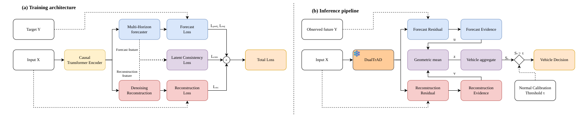

# DualTrAD

Vehicle-level anomaly detection for electric-vehicle battery packs from onboard
BMS signals, with a dual-evidence detector and reproducible baselines under one
shared protocol.

The detector fuses two kinds of evidence produced by a single shared encoder — a
multi-horizon **forecasting** residual and a denoising **reconstruction**
residual. "Dual" refers to the two kinds of evidence, not to two branches of the
same kind and not to two encoders.

Evaluated on two public EV battery datasets with vehicle-level labels, DualTrAD
leads on Dataset A and holds that level on Dataset B, collected from different
manufacturers under a different sampling regime.



**(a)** Training: one shared causal encoder feeds a multi-horizon forecaster and
a denoising reconstruction branch, optimised jointly on normal vehicles only.
**(b)** Inference: the encoder is frozen, each residual becomes an evidence, the
two are fused by a geometric mean, and snippet scores are aggregated per vehicle
and compared against a threshold fitted on normal calibration vehicles.
The vector version is [`docs/architecture.pdf`](docs/architecture.pdf).

---

## Why the layout looks like this

Every published detector in this repository is trained and scored through the
same data contract, the same loss interface and the same decision rule, so a
difference between two rows of a results table is a difference between models
and nothing else.

```
DualTrAD/
├── config/                 one YAML per model; a variant states only what it changes
│   ├── qas/                Dataset A, the four-channel contract
│   └── tsinghua/           Dataset B, the contract only -- see its README
├── data/
│   ├── README.md           dataset construction and preprocessing  ← read this first
│   └── preprocessing/      scripts that turn raw exports into split NPZs
└── src/
    ├── datas/              splits, per-channel standardisation, windowing, corruption
    ├── losses/             the training objective and its terms
    ├── metrics/            residuals → evidence → fusion → threshold → metrics
    ├── models/
    │   ├── shared/         encoders, decoders, heads, autoencoder — reused by all
    │   ├── dualtrad/       the proposed detector
    │   ├── predtrad/       PredTrAD-V1 adapter
    │   ├── tranad/         TranAD adapter
    │   ├── dtaad/          DTAAD adapter
    │   └── third_party/    vendored upstream bodies + SHA-256 provenance
    ├── system/             trainer, evaluator, and the config runner
    └── utils/              config loading, seeding, device selection
```

Each model folder holds exactly one assembling class in `model.py`. It reads a
plain configuration dictionary, builds its submodules in `init_modules`, and
describes itself through `get_config()`, so a finished run can be reconstructed
from its serialised configuration alone.

---

## Quick start

```bash
python -m venv .venv && .venv/Scripts/activate     # Windows
pip install -r requirements.txt

python -m scripts.run --config config/qas/dualtrad.yaml --output runs/qas_dualtrad
```

Any model in the table below can be swapped in by pointing `--config` at its
YAML file. Nothing else changes.

---

## Models

| Config | Class | Evidence | Params | Notes |
|---|---|---|---:|---|
| `dualtrad.yaml` | `DualTrAD` | forecast + reconstruction | 246,844 | the proposed detector |
| `predtrad.yaml` | `PredTrADv1` | forecast | 2,109,956 | Schuster et al. |
| `tranad.yaml` | `TranAD` | reconstruction (adapted) | 6,948 | Tuli et al. |
| `dtaad.yaml` | `DTAAD` | reconstruction (adapted) | 1,042 | Yu et al. |

(Parameter counts are for the four-channel contract.)

### Ablations

Two kinds, and they answer different questions. Keeping them apart is the point.

**Re-scoring.** These reuse the trained weights of `dualtrad` and change only
the scoring step, so nothing but the fusion differs. That is what makes a gain
attributable to the fusion rather than to capacity or to a training signal.

| Config | Score | Question |
|---|---|---|
| `dualtrad_forecast_only.yaml` | `z = u` | is the reconstruction evidence carrying anything? |
| `dualtrad_reconstruction_only.yaml` | `z = v` | is the forecasting evidence carrying anything? |

**Retraining.** These remove a branch *before* training, so the shared encoder
never sees that objective. Comparing each against the matching re-scoring
config separates what a branch contributes to the representation from what it
contributes as evidence.

| Config | Trained without | Scored with |
|---|---|---|
| `dualtrad_no_autoencoder.yaml` | the reconstruction loss | `z = u` |
| `dualtrad_no_forecasting.yaml` | the forecasting loss | `z = v` |

### Baseline provenance

Upstream model bodies are vendored verbatim under `src/models/third_party/`
with a SHA-256 record in `PROVENANCE.json`. The only edits are import
statements, needed because the files import each other as `src.*` upstream; no
layer, hyper-parameter or forward path was changed. Each adapter records its own
adaptation in `model.get_config()["adaptation"]`, including what had to change to
turn a reconstruction model into a forecaster.

Adapted baselines are **not** reproductions of the published numbers. The
original papers use different tasks, thresholds and metrics; comparing against
their reported scores is not meaningful. All numbers here come from re-running
every method under this repository's protocol.

---

## How a score becomes a decision

The pipeline is split so that no step can see a test label before the operating
point is fixed:

```
model output ──► window residuals            src/metrics/scoring.py
                    │                        (per horizon and per channel)
                    ▼
             evidence normalisation          scales fitted on NORMAL calibration only
                    │                        each channel by its own scale
                    ▼
                 fusion                      geometric mean, or a single evidence
                    │
                    ▼
            vehicle aggregation              a high quantile of that vehicle's windows
                    │
                    ▼
               threshold                     src/metrics/decision.py
                    │                        fitted on NORMAL calibration vehicles
                    ▼
               evaluation                    ← the first and only read of a test label
```

Two details are worth stating because they are easy to get wrong:

**Normalise per channel before combining.** Residuals are kept per channel until
each has been divided by its own calibration scale. Averaging raw errors first
lets whichever channel has the largest scale dominate the score. On the primary
dataset the voltage channel carries 94 % of the raw squared error while being the
only channel with no discriminative power, and combining before normalising
drives the forecasting evidence to 0.474–0.486 AUROC, below chance. Normalising
first restores it to 0.789–0.793.

**Fit the threshold on the distribution it is applied to.** A vehicle score is a
*mean* of high window scores; a threshold read off the *window* score
distribution sits far above it. `snippet_tail_threshold` reproduces that legacy
rule for reference, but `normal_quantile_threshold` is the default: it uses the
normal calibration vehicles at a stated target false-positive rate, consumes no
abnormal labels, and turns the operating point into a specification.

AUROC and AUPR are threshold-free and therefore identical under either rule.
Report them as the primary metrics; report `F1` only alongside the false-positive
rate it was measured at, since models at different operating points are not
comparable on `F1` alone.

---

## Results

Two datasets, one protocol, three seeds per model (42/43/44). AUROC and AUPR are
reported because they are threshold-free; see the note on `F1` above. Standard
deviation across seeds in brackets.

**Dataset A** (`qas`) — 4 channels, 94 scored vehicles (36 normal / 58 abnormal).

| Model | AUROC | AUPR |
|---|---:|---:|
| **DualTrAD** | **0.8147** (0.0036) | **0.8956** (0.0030) |
| DTAAD | 0.7703 (0.0350) | 0.8543 (0.0170) |
| PredTrAD_v1 | 0.7695 (0.0042) | 0.8752 (0.0032) |
| TranAD | 0.7399 (0.0021) | 0.8565 (0.0012) |

The margin over every published baseline holds in **all three seeds**
(seed-paired AUROC: TranAD +0.075, PredTrAD_v1 +0.045, DTAAD +0.044; 3/3 seeds
each), and DualTrAD's own seed spread of 0.0036 is an order of magnitude smaller
than those margins.

**Dataset B** (Tsinghua) — 7 channels, 3 manufacturers x 5 vehicle folds, 10 s
sampling. Macro over manufacturers, so each entry is 15 folds x 3 seeds.

| Model | AUROC | AUPR |
|---|---:|---:|
| **DualTrAD** | **0.7710** (0.0098) | **0.7303** (0.0170) |
| PredTrAD_v1 | 0.7535 (0.0084) | 0.6907 (0.0110) |
| TranAD | 0.6902 (0.0095) | 0.6675 (0.0084) |
| DTAAD | 0.5663 (0.0281) | 0.5502 (0.0231) |

DualTrAD is highest here and leads every baseline in all three seeds, but a sign
test over the 45 (manufacturer, fold, seed) cells separates it only from DTAAD
(+0.205, 40/43, p < 1e-4). It does not separate it from TranAD (+0.081, 26/45,
p = 0.37) or from PredTrAD_v1 (+0.018, 23/45, p = 1.00): fold-to-fold variance
absorbs a mean gap of that size. We read this as the detector *holding* its
level on data it was not tuned for, not as a second win.

> **Dataset B is not reproducible from this repository.** Its protocol —
> per-manufacturer folds, the fold-level calibration split, and the seven-channel
> contract — is recorded in [`config/tsinghua/`](config/tsinghua/) but the driver
> that executes it is not included here. It also aggregates a vehicle differently: the
> mean of that vehicle's largest `rho` fraction, with `rho` selected on
> calibration, where `aggregate_vehicles` here takes a fixed 0.99 quantile. The
> numbers above are reported for completeness; only Dataset A can be
> re-run from `config/qas/`.

### Ablation

Scoring one set of trained weights three ways. Nothing is retrained, so the rows
differ only in the fusion step.

| Score | Primary | Second |
|---|---:|---:|
| forecast only, `z = u` | 0.7910 (−0.024) | 0.7368 (−0.034) |
| reconstruction only, `z = v` | 0.7561 (−0.059) | 0.6886 (−0.082) |
| **both, `z = sqrt(u v)`** | **0.8147** | **0.7710** |

Neither evidence alone reaches the fusion, on either dataset. The gain is
positive in 3/3 seeds on Dataset A, and on Dataset B in 35 of 44 and
36 of 45 decided cells (p <= 0.0001). The two residuals are only weakly related
(Pearson r = 0.32–0.37 over 385,024 test windows), which is why combining them
adds information rather than repeating it.

Retraining without a branch, on Dataset A, separates what a branch
gives the representation from what it gives as evidence:

| Trained without | Scored with | AUROC | against |
|---|---|---:|---|
| the reconstruction loss | `z = u` | 0.7976 | 0.7910 — the autoencoder *costs* the forecasting branch 0.007, 3/3 seeds |
| the forecasting loss | `z = v` | 0.7781 | 0.7561 — the forecasting branch costs the reconstruction branch 0.022, 2/3 seeds, the third flat |

Each branch slightly degrades the other's evidence during training, yet the
fusion beats both retrained single-branch models, by +0.017 and +0.037 AUROC in
3/3 seeds. Neither branch is a representation-learning aid; both earn their
place as evidence at scoring time.

Numbers are produced by the configs in `config/`; nothing here is tuned on test
data.

## Evaluation notes

- **Labels are per vehicle**, assigned retroactively by engineers after pack
  disassembly. Decisions are therefore made per vehicle, not per timestep, which
  also removes the point-adjustment ambiguity that affects timestep-level
  protocols. No peak-over-threshold calibration and no point adjustment is used
  anywhere in this repository.
- **Seeds matter more than folds.** Brand or fold averages capture data-split
  variance only; they say nothing about initialisation variance. Run at least
  three seeds before reporting a difference, and compare it against the
  seed-to-seed spread of the same model.

---

## Environment

Python 3.11, CUDA 12.8. Pinned versions are in `requirements.txt`.

| Package | Version | Used for |
|---|---|---|
| `torch` | 2.11.0+cu128 | models, training |
| `numpy` | ≥ 1.26 | residuals, scoring, metrics |
| `pyyaml` | ≥ 6.0 | configuration |
| `pandas` | ≥ 2.0 | preprocessing only |

Metrics are implemented in `src/metrics/ranking.py` rather than taken from
scikit-learn, so tie handling is fixed and auditable.

---

## Citing the datasets

Neither dataset is introduced here. Both are public and must be cited from their
original publications; see [`data/README.md`](data/README.md) for the exact
references, access links, and the preprocessing this repository applies on top
of them.
